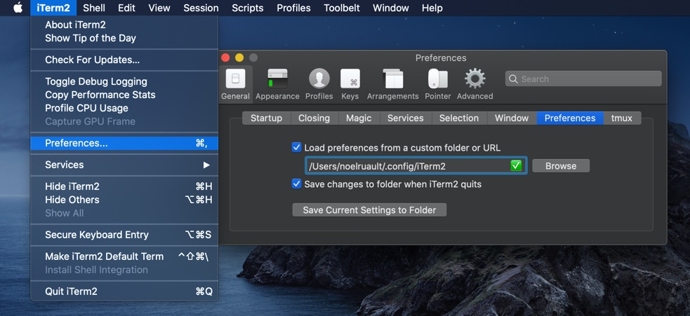

# iTerm

## iTerm Configuration Settings

You should configure preferences as shown in the following image to allow iTerm to load and save settings correctly.

Note that the default and mandatory name for the loaded and saved file is "com.googlecode.iterm2.plist".

## iTerm Color Schemes

### Intro

There is a set of color schemes for iTerm [published online](https://github.com/mbadolato/iTerm2-Color-Schemes)

Instructions for using them are detailed there but just to make it easier and in order to install any of the themes stored in "color-schemes" folder, you can follow the next steps:

### Installation Instructions

There are 2 ways to install an iTerm theme (both go to the same configuration location):

* Direct way via keyboard shortcut:
	* Launch iTerm 2.
	* Type CMD+i (⌘+i)
	* Navigate to **Colors** tab
	* Click on **Color Presets**
	* Click on **Import**
	* Click on the **schemes** folder
	* Select the **.itermcolors** profiles you would like to import
	* Click on **Color Presets** and choose a color scheme

* Via iTerm preferences
	* Launch iTerm 2.
	* Click on **iTerm2** menu title
	* Select **Preferences...** option
	* Select **Profiles**
	* Navigate to **Colors** tab
	* Click on **Color Presets**
	* Click on **Import**
	* Select the .itermcolors file(s) of the you'd like to use
	* Click on **Color Presets** and choose a color scheme

## oh-my-zsh

	`ln -sF ~/.config/iTerm2/oh-my-zsh ~/.oh-my-zsh` # https://linux.die.net/man/1/ln

