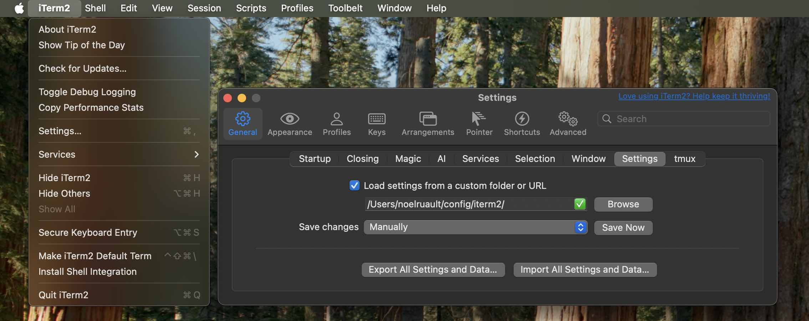

# iTerm

## iTerm Configuration Settings

You should configure preferences as shown in the following image to allow iTerm to load and save settings correctly.

Note that the default and mandatory name for the loaded and saved file is "com.googlecode.iterm2.plist".

## iTerm Color Schemes

[Installation Instructions](https://iterm2colorschemes.com)

## oh-my-zsh

	`ln -sF ~/.config/iTerm2/oh-my-zsh ~/.oh-my-zsh` # https://linux.die.net/man/1/ln
